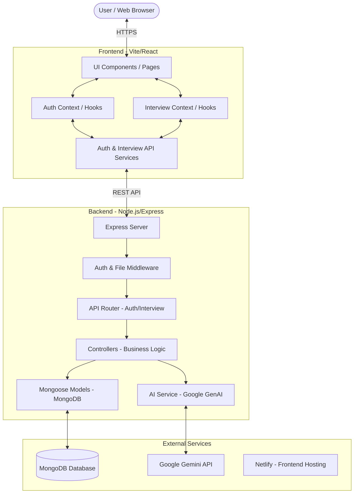

# System Design Architecture - Gen-Ai

This document outlines the high-level architecture and system design for the Gen-Ai project, an AI-powered interview preparation platform.

## 1. System Overview
The platform allows users to register, login, and generate interview preparation reports (including technical and behavioral questions) based on job descriptions or resumes using Generative AI.

## 2. High-Level Architecture
The system follows a classic **MERN-like** architecture (with Vite/React instead of standard CRA) split into a decoupled Frontend and Backend.

## 3. Component Details

### 3.1 Frontend (Frontend/)
- **Technology Stack**: React, Vite, SCSS.
- **State Management**: React Context API (`auth.context.jsx`, `interview.context.jsx`).
- **Routing**: React Router (`app.routes.jsx`).
- **Features**:
  - **Auth**: Login/Registration with JWT stored in cookies.
  - **Interview**: Home dashboard and Interview report viewing.

### 3.2 Backend (Backend/)
- **Technology Stack**: Node.js, Express.
- **Database**: MongoDB via Mongoose.
- **Security**: 
  - JWT for authentication.
  - Cookie-based session management.
  - Blacklist model for token invalidation during logout.
- **AI Integration**: Uses `GoogleGenAI` (Gemini API) to generate interview content based on Zod-defined schemas.

### 3.3 Data Models
- **User**: Stores user credentials and profile info.
- **InterviewReport**: Stores generated interview questions, scores, and feedback.
- **Blacklist**: Stores invalidated JWT tokens.

## 4. Key Workflows

### 4.1 Interview Generation
1. User submits job details via the Frontend.
2. The `interview.controller.js` calls `ai.service.js`.
3. `ai.service.js` sends a structured prompt to Google Gemini.
4. The AI returns a JSON response matching the predefined schema.
5. The report is saved to MongoDB and returned to the user.

### 4.2 Authentication
1. User logs in; Backend validates credentials and issues a JWT in a cookie.
2. `auth.middleware.js` protects interview routes by verifying the JWT.
3. Logout adds the token to the `blacklist.model.js`.

## 5. Infrastructure & Deployment
- **Frontend Hosting**: Netlify.
- **Backend Hosting**: (Proposed: Render/Heroku/Railway).
- **Database**: MongoDB Atlas.
- **Environment Management**: `.env` files for API keys and DB URIs.
